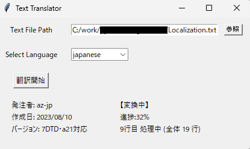

# 翻訳作業の流れ
翻訳作業は以下の流れで行ってください

0. 長文は手動にて、まとめてください
1. アイテム名のtxt作成してkey翻訳～A～
2. 文章のtxtを作成して翻訳～B～
3. エディタで　AとBを一つにする

# 翻訳ツールの使い方

1. text_translate.exeをダブルクリックしてGUIを起動します
2. 「browse」ボタンを押して、翻訳したいテキストファイルを選択します
3. Select Functionのプルダウンメニューから実行したい機能を選択します
    1. Translate Key Only
        - Keyだけが記述されたファイルを翻訳する時に選択してください
        - テンプレートが記入されていない場合、翻訳後のファイルの１行目にテンプレートを挿入します
    2. Translate Language
        - 各項目が埋まっているファイルを翻訳するときに選択してください
        - 選択した言語をそのほかの言語に翻訳します
4. Select Languageのプルダウンメニューから翻訳前の言語を選択します (初期値はKeyになっています)
    - Translate Key Only選択時はKey以外の選択肢はありません
5. 「Start Translation」ボタンを押して翻訳を開始します。
    - ボタンを押すと、GUI右下に進捗が表示されます
6. 処理が終了すると、「Text File Path」に指定したファイルに翻訳結果が出力されます。
    - 元のファイルは末尾に「_old」がついて残ります
    - 出力されたファイルの行頭に、翻訳した日時が追記されます

# 補足

- 機能毎に適切なファイルを入力しなかった場合の動作は保証しません

- ゲーム専用の用語は正しく翻訳が行われない可能性があります。そのような場合は、翻訳前の言語がそのまま出力される可能性があります。

- 翻訳は1言語2秒間隔で行います。
    - Google翻訳を使って翻訳していますが、高速でアクセスするとブロックされることがあるためです
    - そのため、1行の翻訳作業に30秒弱かかります

- 以下の場合は処理をスキップします
    - 翻訳前の言語として指定した箇所が空白だった場合
    - 指定の順番になっていない場合

- 代替テキスト列には何も入力しないようにしています