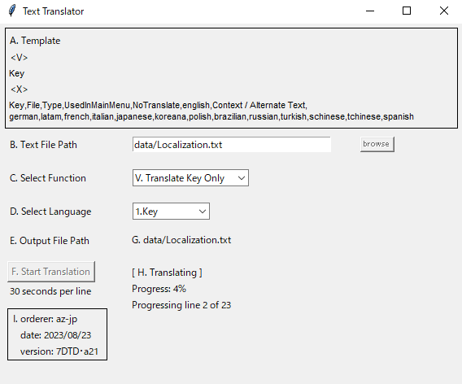

# 使い方

1. text_translate.exeをダブルクリックしてGUIを起動します
2. 「参照」ボタンを押して、翻訳したいテキストファイルを選択します
3. プルダウンから翻訳前の言語を選択します (初期値は日本語になっています)
4. 「翻訳開始」ボタンを押して翻訳を開始します。
    - ボタンを押すと、GUI右下に進捗が表示されます
5. 処理が終了すると、翻訳後のファイルとして、指定したテキストファイルの後ろに「_trans」とついたテキストファイルが出力されます

# 補足

- 以下の場合は処理をスキップします
    - 翻訳前の言語として指定した箇所が空白だった場合
    - 指定の順番になっていない場合

- 代替テキスト列には何も入力しないようにしています